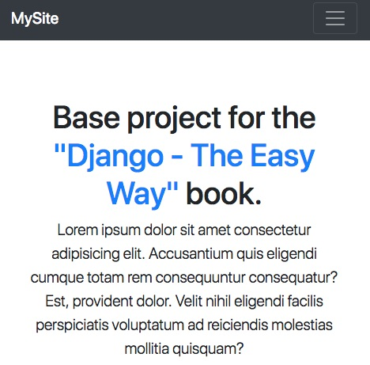
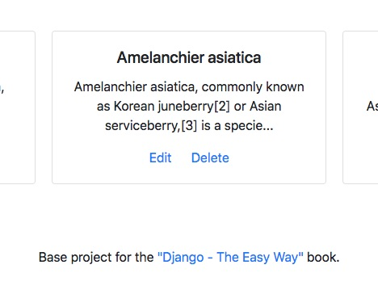
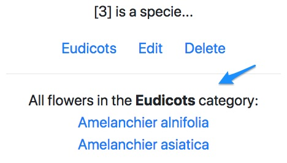
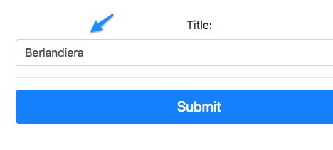
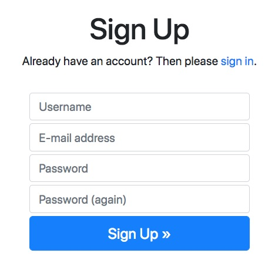
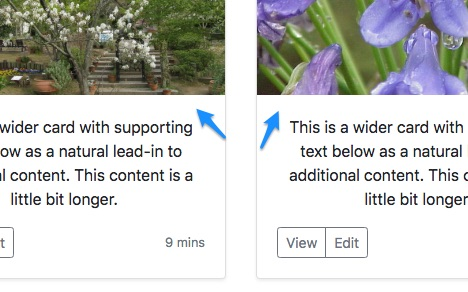
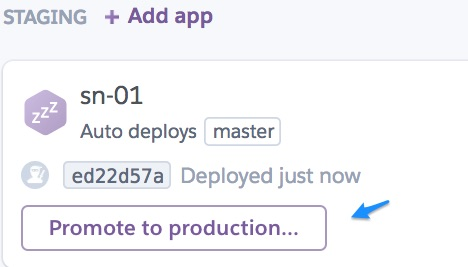

"[Django - The Easy Way](https://samuli.to/Django-The-Easy-Way)" book is a practical, step-by-step guide on how to build Django websites. This repository is intended to serve as a companion to the written text.

[Django](https://samuli.to/Django-Web-Framework) is a [Python](https://samuli.to/Python) based open source **web development framework** that has been around since 2005. It enables you to create complex *database-driven* websites while keeping things [decoupled](https://samuli.to/Coupling) and [dry](https://samuli.to/Dry). The *Python Package Index* ([PyPI](https://samuli.to/PyPI)) hosts numerous free [packages](https://samuli.to/Django-Packages) that can be used to extend projects without re-inventing the wheel. Django is used by some well-known sites like [Instagram](https://samuli.to/Instagram), [Bitbucket](https://samuli.to/Bitbucket) and [Disqus](https://samuli.to/Disqus).

# About this book

This book is about **learning the Django web framework** with simple, practical examples. It guides you through all the main concepts one at the time. We will work on many small projects rather than working on a single big application through the book. This helps digesting the information as the projects have less distracting code from previous chapters. By the end of the book you should have a solid understanding of how to build and deploy apps with Django.

## Who is this book for?

This book is suitable for **beginner** to **intermediate** level web developers. You don't have to have any experience with Django or building web applications in general. We start with the very basics and increase complexity as we go along. 

## What this book is NOT about?

We use [Bootstrap 4](https://samuli.to/Bootstrap) to have a decent looking testing playground but otherwise *frontend* concepts are covered minimally. This is not a book about *Python*, *HTML*, *CSS* or *JavaScript*. Basic knowledge about those technologies would be helpful but is *not required* for the book. The focus is on the Django web framework **core concepts** and **deployment practices**.

## How this book is organized

This book is organized in 32 chapters that focus on key concepts of the framework. I recommend reading the book in sequence, starting from the very beginning and working your way to the end from there.

### Chapters 1-7 

Chapters 1-7 cover how to **install Python** and use **virtual environments**.

### Chapters 8-10

In chapters *8-10* we create a simple *Django project* and examine the **project structure**. "Hello world" project introduces the reader to **views**, **paths** and **templates**.

### Chapters 11-13

Chapters *11-13* cover how the **template inheritance** works and how to integrate **Bootstrap 4** frontend framework with Django. We also apply custom styles with **CSS** (Cascading Style Sheets).



### Chapters 14-16

Chapters *14-16* cover how to use **models** and interact with a database. We learn about **filters** and how to build a **base project** that can be used as a starting point for other projects. We create a **detail page** and learn how to work with **slugs** and **reverse URLS**.



### Chapters 17-20

In chapters *17-20* we learn how to *categorise* items with a **ForeignKey** field and *tag* items with a **ManyToManyField**. We do **lookups** through relationships, **re-use templates** and build a minimalistic **search** feature.



### Chapters 21-24

Chapters *21-24* show how to create *forms* with **ModelForm**. We **customize** the forms by changing *field order* and render *validation errors* manually. The **Python interactive interpreter** is used to manipulate objects and interact with Django.



### Chapters 25-26

Chapters *25-26* cover how to create a complete **authentication** system with the *Allauth* package and how to theme the default forms with *Bootstrap 4*. User **authorization** is managed with *groups* and *decorators*.



### Chapters 27-28

In chapters *27-28* we **upload images** and serve them from a local media folder. Bootstrap 4 is used to create a **grid** view to display the images. The uploaded images are compressed to **thumbnails** using the *ImageKit* package.



### Chapters 29-32

Chapters *29-32* show how to **deploy** to [Heroku](https://www.heroku.com) platform and serve *static* assets and *user-uploaded* files from an **Amazon AWS bucket**. We learn how to establish **continuous deployment** workflows with Heroku *pipelines* and **send emails** with *SendGrid*.



## About the author

Samuli Natri has been a software developer since the 90's. He attended Helsinki University Of Technology (Computer Science) and Helsinki University (Social Sciences).

Website: <https://samulinatri.com>

## How to use this repository

Install GIT: <https://samuli.to/Git>

Clone the project:

```
git clone git@github.com:SamuliNatri/Django-The-Easy-Way-Source-Code.git
cd DjangoTheEasyWay-Source-Code
```

Install dependencies:

```
python3 -m venv venv
source venv/bin/activate
pip install -r requirements.txt
```

Visit any folder and run the development server:

```
cd 28-Image-Thumbnails
python manage.py runserver
```

Visit <http://127.0.0.1:8000/>

Some projects contain a *database* with content and an admin user. Use the following credentials to login:

- username: *admin*
- password: *admin*

### Notes

- The example project "29-31-Heroku" requires you to create a *local_settings.py* file and add *ACCESS KEYS*.

- The example project "32-Sending-Emails" requires you to add configuration to the *settings.py* file. 

Follow the instructions in the book to fill in the correct configuration.
